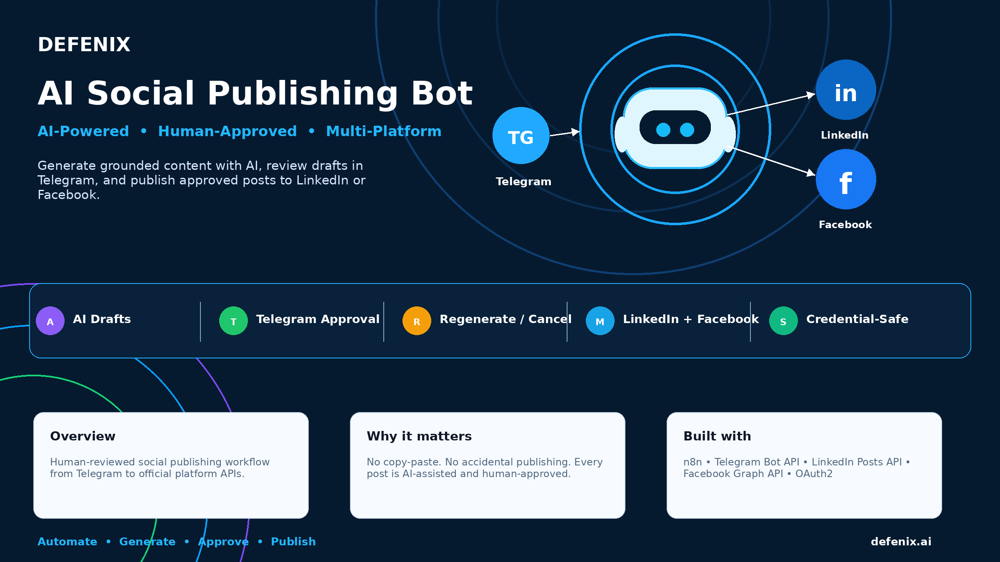
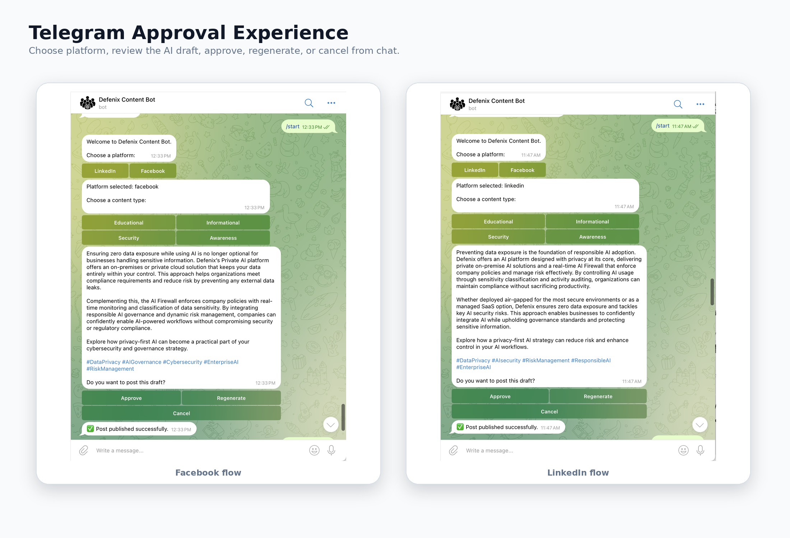
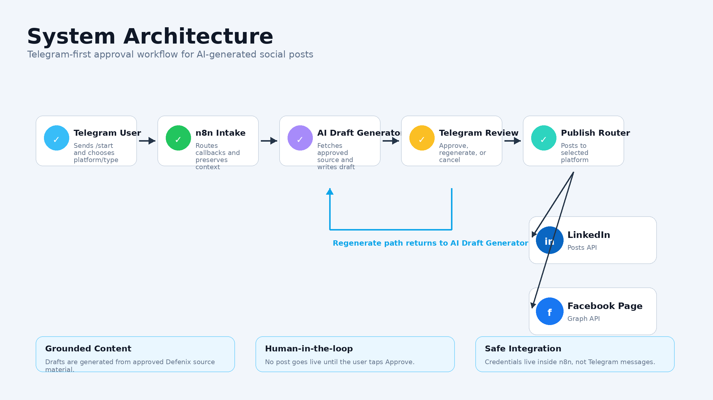
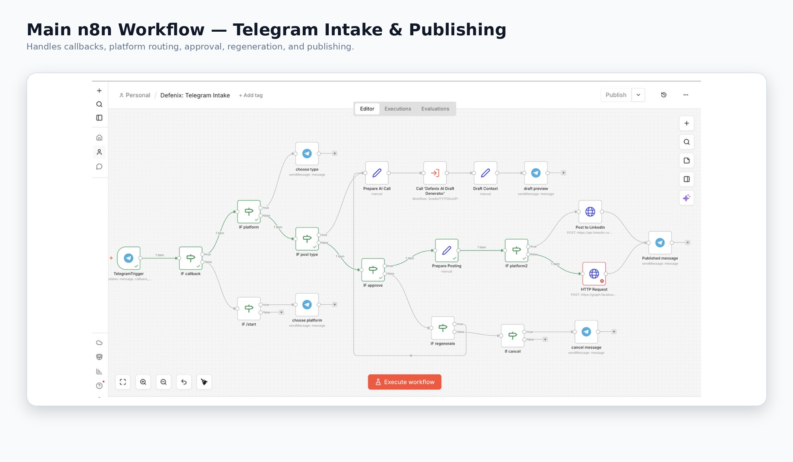
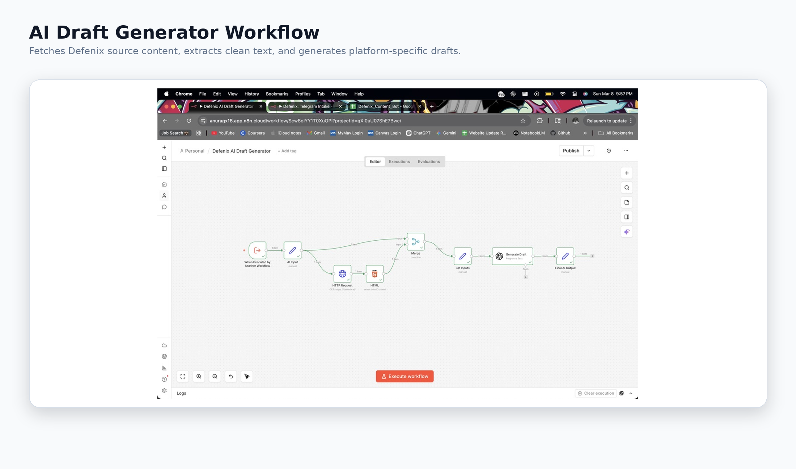
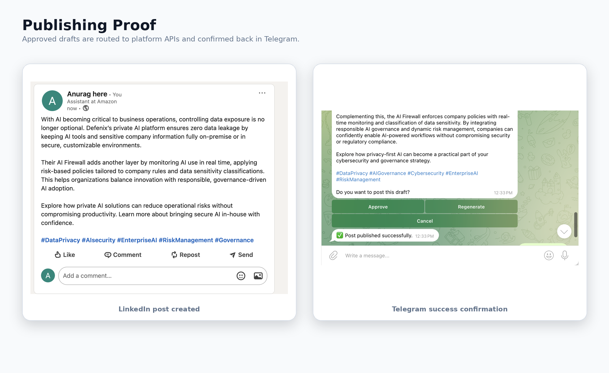

# Defenix AI Social Publishing Bot



AI-powered, human-approved social publishing workflow built with **n8n**, **Telegram**, **LinkedIn**, and **Facebook Graph API**.

This project turns Telegram into a lightweight content command center: generate AI drafts, review them, regenerate when needed, and publish approved posts directly to LinkedIn or Facebook.

---

## Why this project exists

Social media publishing often becomes a messy manual process:

- generate content in one tool
- copy it into another platform
- edit it again
- switch between LinkedIn and Facebook
- manually track what was approved or posted

This workflow solves that by creating a simple approval-based publishing system where AI helps with drafting, but the user stays in control before anything goes live.

---

## Demo

### Telegram approval flow



The user starts the bot, chooses a platform, selects a content type, reviews the generated draft, and then approves, regenerates, or cancels.

---

## System Architecture



The system is split into two workflows:

1. **Telegram Intake & Publishing Workflow**
   - Handles Telegram callbacks
   - Routes platform and content-type selections
   - Preserves platform context
   - Handles approve / regenerate / cancel
   - Publishes to LinkedIn or Facebook

2. **AI Draft Generator Workflow**
   - Fetches approved Defenix source content
   - Extracts and cleans text
   - Generates a platform-specific draft
   - Returns the draft to the Telegram workflow

---

## Workflow Screenshots

### Main n8n workflow



This workflow manages the complete user journey from Telegram interaction to final publishing.

### AI draft generator workflow



This workflow generates grounded post drafts from approved source content.

---

## Publishing Proof



Approved posts are published directly to the selected platform using official APIs.

---

## What it does

- Starts from Telegram
- Lets the user choose:
  - platform
  - content type
- Calls an AI draft generation workflow
- Sends the generated draft back to Telegram
- Supports:
  - Approve
  - Regenerate
  - Cancel
- Publishes approved content to:
  - LinkedIn
  - Facebook Page
- Sends a confirmation message after publishing

---

## Supported platforms

| Platform | Integration |
|---|---|
| LinkedIn | LinkedIn Posts API |
| Facebook Page | Facebook Graph API |

---

## Core features

- Telegram-first approval flow
- Human-in-the-loop publishing
- AI-generated platform-specific drafts
- Regenerate support for better drafts
- Direct LinkedIn publishing through HTTP Request node
- Direct Facebook Page publishing through Graph API
- Callback-driven workflow logic in n8n
- Platform-aware routing
- Publishing confirmation messages
- Modular workflow design

---

## Tech stack

| Tool | Purpose |
|---|---|
| n8n | Workflow orchestration |
| Telegram Bot API | Chat interface and approval UI |
| AI Draft Generator | Content generation |
| LinkedIn Posts API | LinkedIn publishing |
| Facebook Graph API | Facebook Page publishing |
| OAuth2 | Authentication |
| HTTP Request nodes | Direct API calls |

---

## High-level user flow

```text
/start
  ↓
Choose platform
  ↓
Choose content type
  ↓
Generate AI draft
  ↓
Review in Telegram
  ↓
Approve / Regenerate / Cancel
  ↓
Publish to selected platform
  ↓
Send success confirmation
